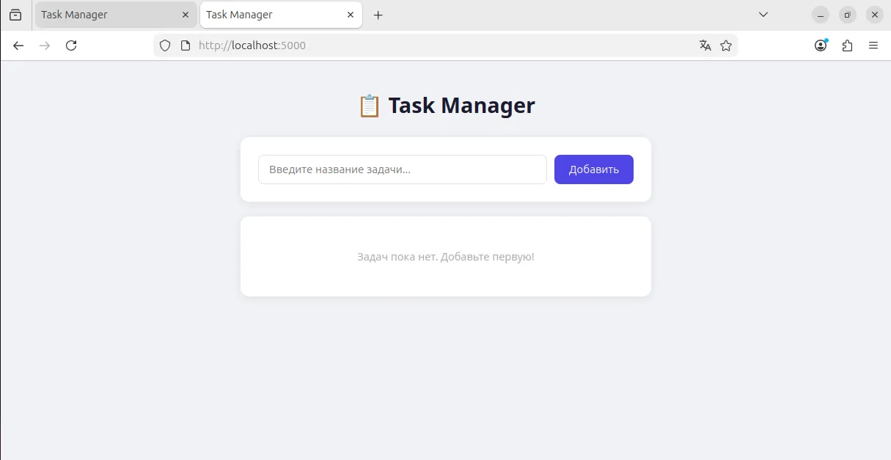
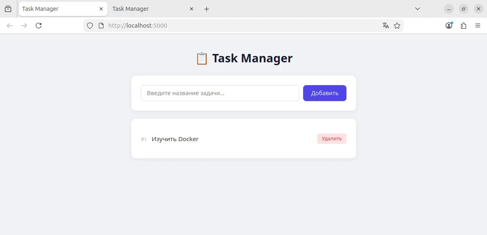

# Лабораторная работа №7
## Аксентьев Максим ИУ8-22
## Работа с Docker
## Подготовка репозитория
```bash
git clone https://github.com/maksnn78/lab7.git
cd lab7
```
```bash
Cloning into 'lab7'...
warning: You appear to have cloned an empty repository.
```
```bash
mkdir -p app/templates db
```
## Установка Docker
```bash
sudo killall unattended-upgr 2>/dev/null; sudo rm -f /var/lib/dpkg/lock-frontend /var/lib/dpkg/lock
sudo apt-get update
sudo apt-get install -y ca-certificates curl gnupg
```
```bash
sudo install -m 0755 -d /etc/apt/keyrings
curl -fsSL https://download.docker.com/linux/ubuntu/gpg | sudo gpg --dearmor -o /etc/apt/keyrings/docker.gpg
sudo chmod a+r /etc/apt/keyrings/docker.gpg
```
```bash
echo \
  "deb [arch=$(dpkg --print-architecture) signed-by=/etc/apt/keyrings/docker.gpg] https://download.docker.com/linux/ubuntu \
  $(. /etc/os-release && echo "$VERSION_CODENAME") stable" | \
  sudo tee /etc/apt/sources.list.d/docker.list > /dev/null
```
```bash
sudo apt-get update
sudo apt-get install -y docker-ce docker-ce-cli containerd.io docker-buildx-plugin docker-compose-plugin
```
```bash
The following NEW packages will be installed:
  containerd.io docker-buildx-plugin docker-ce docker-ce-cli
  docker-ce-rootless-extras docker-compose-plugin pigz
...
Setting up docker-ce (5:29.5.2-1~ubuntu.24.04~noble) ...
```
```bash
sudo usermod -aG docker $USER
newgrp docker
```
```bash
docker --version && docker compose version
```
```bash
Docker version 29.5.2, build 79eb04c
Docker Compose version v5.1.4
```
## Создание файлов приложения
 
### app/app.py
```bash
cat > app/app.py << 'EOF'
from flask import Flask, render_template, request, redirect, url_for
import mysql.connector
import os
 
app = Flask(__name__)
 
def get_db():
    return mysql.connector.connect(
        host=os.environ.get("DB_HOST", "db"),
        user=os.environ.get("DB_USER", "appuser"),
        password=os.environ.get("DB_PASSWORD", "apppassword"),
        database=os.environ.get("DB_NAME", "appdb")
    )
 
@app.route("/", methods=["GET"])
def index():
    conn = get_db()
    cursor = conn.cursor()
    cursor.execute("SELECT id, name FROM tasks ORDER BY id DESC")
    tasks = cursor.fetchall()
    cursor.close()
    conn.close()
    return render_template("index.html", tasks=tasks)
 
@app.route("/add", methods=["POST"])
def add_task():
    name = request.form.get("name", "").strip()
    if name:
        conn = get_db()
        cursor = conn.cursor()
        cursor.execute("INSERT INTO tasks (name) VALUES (%s)", (name,))
        conn.commit()
        cursor.close()
        conn.close()
    return redirect(url_for("index"))
 
@app.route("/delete/<int:task_id>", methods=["POST"])
def delete_task(task_id):
    conn = get_db()
    cursor = conn.cursor()
    cursor.execute("DELETE FROM tasks WHERE id = %s", (task_id,))
    conn.commit()
    cursor.close()
    conn.close()
    return redirect(url_for("index"))
 
if __name__ == "__main__":
    app.run(host="0.0.0.0", port=5000, debug=True)
EOF
```
### app/requirements.txt
```bash
cat > app/requirements.txt << 'EOF'
flask==2.3.3
mysql-connector-python==8.1.0
EOF
```
### db/init.sql
```bash
cat > db/init.sql << 'EOF'
CREATE DATABASE IF NOT EXISTS appdb;
USE appdb;
 
CREATE TABLE IF NOT EXISTS tasks (
    id INT AUTO_INCREMENT PRIMARY KEY,
    name VARCHAR(255) NOT NULL,
    created_at TIMESTAMP DEFAULT CURRENT_TIMESTAMP
);
EOF
```
### docker-compose.yml
```bash
cat > docker-compose.yml << 'EOF'
version: '3.8'

services:
  app:
    build: .
    container_name: lab_docker
    ports:
      - "5000:5000"
    depends_on:
      db:
        condition: service_healthy
    environment:
      - DB_HOST=db
      - DB_USER=${DB_USER}
      - DB_PASSWORD=${DB_PASSWORD}
      - DB_NAME=${DB_NAME}
    restart: on-failure

  db:
    image: mysql:8.0
    container_name: mysql_db
    restart: always
    environment:
      MYSQL_ROOT_PASSWORD: ${DB_ROOT_PASSWORD}
      MYSQL_DATABASE: ${DB_NAME}
      MYSQL_USER: ${DB_USER}
      MYSQL_PASSWORD: ${DB_PASSWORD}
    ports:
      - "3306:3306"
    volumes:
      - db_data:/var/lib/mysql
      - ./db/init.sql:/docker-entrypoint-initdb.d/init.sql
    healthcheck:
      test: ["CMD", "mysqladmin", "ping", "-h", "localhost"]
      interval: 10s
      timeout: 5s
      retries: 5

volumes:
  db_data:
EOF
```
## Коммиты и пуш
```bash
git add .
git commit -m "initial: flask app, Dockerfile, docker-compose with mysql"
```
```bash
[main (root-commit) 4933536] initial: flask app, Dockerfile, docker-compose with mysql
 6 files changed, 199 insertions(+)
 create mode 100644 Dockerfile
 create mode 100644 app/app.py
 create mode 100644 app/requirements.txt
 create mode 100644 app/templates/index.html
 create mode 100644 db/init.sql
 create mode 100644 docker-compose.yml
```
```bash
git push -u origin main
```
```bash
Username for 'https://github.com': maksnn78
Password for 'https://maksnn78@github.com': 
Enumerating objects: 11, done.
Counting objects: 100% (11/11), done.
Delta compression using up to 4 threads
Compressing objects: 100% (8/8), done.
Writing objects: 100% (11/11), 3.09 KiB | 264.00 KiB/s, done.
Total 11 (delta 0), reused 0 (delta 0), pack-reused 0
To https://github.com/maksnn78/lab7.git
 * [new branch]      main -> main
branch 'main' set up to track 'origin/main'.
```
## Часть I. Docker
 
### Dockerfile
```bash
cat > Dockerfile << 'EOF'
FROM python:3.9-slim
 
WORKDIR /app
 
RUN apt-get update && apt-get install -y \
    build-essential \
    && rm -rf /var/lib/apt/lists/*
 
COPY app/requirements.txt .
 
RUN pip install --no-cache-dir -r requirements.txt
 
COPY app/ .
 
EXPOSE 5000
 
CMD ["python", "app.py"]
EOF
```
### Сборка образа
```bash
docker build -t web-app .
```
```bash
[+] Building 109.7s (11/11) FINISHED                             docker:default
 => [internal] load build definition from Dockerfile                       0.1s
 => => transferring dockerfile: 308B                                       0.0s
 => [internal] load metadata for docker.io/library/python:3.9-slim         4.0s
 => [internal] load .dockerignore                                          0.1s
 => => transferring context: 2B                                            0.0s
 => [1/6] FROM docker.io/library/python:3.9-slim@sha256:2d97f6910b16bd338  7.5s
 => => resolve docker.io/library/python:3.9-slim@sha256:2d97f6910b16bd338  0.1s
 => => sha256:ea56f685404adf81680322f152d2cfec62115b30dda481c 251B / 251B  0.2s
 => => sha256:fc74430849022d13b0d44b8969a953f842f59c6e9 13.88MB / 13.88MB  2.7s
 => => sha256:b3ec39b36ae8c03a3e09854de4ec4aa08381dfed84a 1.29MB / 1.29MB  1.0s
 => => sha256:38513bd7256313495cdd83b3b0915a633cfa475dc 29.78MB / 29.78MB  5.0s
 => => extracting sha256:38513bd7256313495cdd83b3b0915a633cfa475dc2a07072  0.8s
 => => extracting sha256:b3ec39b36ae8c03a3e09854de4ec4aa08381dfed84a9daa0  0.2s
 => => extracting sha256:fc74430849022d13b0d44b8969a953f842f59c6e9d1a0c2c  1.0s
 => => extracting sha256:ea56f685404adf81680322f152d2cfec62115b30dda481c2  0.2s
 => [internal] load build context                                          0.1s
 => => transferring context: 4.93kB                                        0.0s
 => [2/6] WORKDIR /app                                                     3.0s
 => [3/6] RUN apt-get update && apt-get install -y     build-essential    50.7s
 => [4/6] COPY app/requirements.txt .                                      0.6s 
 => [5/6] RUN pip install --no-cache-dir -r requirements.txt              19.9s 
 => [6/6] COPY app/ .                                                      0.3s 
 => exporting to image                                                    23.0s
 => => exporting layers                                                   16.7s
 => => exporting manifest sha256:bf4df1eb95fe75a152558176d6c8ab85b655b929  0.0s
 => => exporting config sha256:57ce38960a02e26f22bba7a05f3ae920b46237c3f3  0.0s
 => => exporting attestation manifest sha256:88b4350518d1c522f4b571a7bb60  0.1s
 => => exporting manifest list sha256:0276ca494d63db92728677bf33e71a83f14  0.1s
 => => naming to docker.io/library/web-app:latest                          0.0s
 => => unpacking to docker.io/library/web-app:latest                       5.9s
```
### Запуск контейнера
```bash
docker run -d --name web_app_container -p 5000:5000 web-app
```
```bash
4d2c8f2d1b448ff7585fb20df198bc8838431ea3698bb4af48412428d2a2c4e3
```
### Копирование README.md в контейнер
```bash
cat > README.md << 'EOF'
# Лабораторная работа №7
## Аксентьев Максим ИУ8-22
## Работа с Docker
EOF
```
```bash
docker cp README.md web_app_container:/home/README.md
```
```bash
Successfully copied 356B (transferred 2.05kB) to web_app_container:/home/README.md
```
### Подключение к контейнеру в интерактивном режиме
```bash
docker exec -it web_app_container /bin/bash
```
```bash
root@4d2c8f2d1b44:/app# ls /home/
README.md
root@4d2c8f2d1b44:/app# exit
exit
```
### Остановка контейнера
```bash
docker stop web_app_container
```
```bash
web_app_container
```
## Часть II. Docker Compose
### Запуск связки web-приложение — БД
```bash
docker compose up --build
```
```bash
WARN[0000] /home/vboxuser/lab7/docker-compose.yml: the attribute `version` is obsolete, it will be ignored, please remove it to avoid potential confusion 
[+] up 14/14
 ✔ Image mysql:8.0 Pulled                                                  41.1s
[+] Building 2.4s (13/13) FINISHED                                              
 => [internal] load local bake definitions                                 0.0s
 => => reading from stdin 472B                                             0.0s
 => [internal] load build definition from Dockerfile                       0.0s
 => => transferring dockerfile: 308B                                       0.0s
 => [internal] load metadata for docker.io/library/python:3.9-slim         1.3s
 => [internal] load .dockerignore                                          0.0s
 => => transferring context: 2B                                            0.0s
 => [internal] load build context                                          0.0s
 => => transferring context: 171B                                          0.0s
 => [1/6] FROM docker.io/library/python:3.9-slim@sha256:2d97f6910b16bd338  0.1s
 => => resolve docker.io/library/python:3.9-slim@sha256:2d97f6910b16bd338  0.0s
 => CACHED [2/6] WORKDIR /app                                              0.0s
 => CACHED [3/6] RUN apt-get update && apt-get install -y     build-essen  0.0s
 => CACHED [4/6] COPY app/requirements.txt .                               0.0s
 => CACHED [5/6] RUN pip install --no-cache-dir -r requirements.txt        0.0s
 => CACHED [6/6] COPY app/ .                                               0.0s
 => exporting to image                                                     0.2s
 => => exporting layers                                                    0.0s
 => => exporting manifest sha256:88aa87f69adb4b26021f08dc5dee8867d89e2997  0.0s
 => => exporting config sha256:c99708e8357ef7f4a29183da2428268189349583aa  0.0s
 => => exporting attestation manifest sha256:d347ae8cbc1f1cf011f1fa399124  0.0s
 => => exporting manifest list sha256:9d1cd1d268a6771b3b6f6e097a4fb703288  0.0s
 => => naming to docker.io/library/lab7-app:latest                         0.0s
[+] up 19/19king to docker.io/library/lab7-app:latest                      0.0s
 ✔ Image mysql:8.0      Pulled                                             41.1s
 ✔ Image lab7-app       Built                                               2.6s
 ✔ Network lab7_default Created                                             0.1s
 ✔ Volume lab7_db_data  Created                                             0.0s
 ✔ Container mysql_db   Created                                            19.0s
 ✔ Container lab_docker Created                                             0.2s
Attaching to lab_docker, mysql_db
Container mysql_db Waiting 
mysql_db  | 2026-06-03 10:25:10+00:00 [Note] [Entrypoint]: Entrypoint script for MySQL Server 8.0.46-1.el9 started.
mysql_db  | 2026-06-03 10:25:11+00:00 [Note] [Entrypoint]: Switching to dedicated user 'mysql'
mysql_db  | 2026-06-03 10:25:11+00:00 [Note] [Entrypoint]: Entrypoint script for MySQL Server 8.0.46-1.el9 started.
mysql_db  | 2026-06-03 10:25:11+00:00 [Note] [Entrypoint]: Initializing database files
mysql_db  | 2026-06-03T10:25:11.354781Z 0 [Warning] [MY-011068] [Server] The syntax '--skip-host-cache' is deprecated and will be removed in a future release. Please use SET GLOBAL host_cache_size=0 instead.
mysql_db  | 2026-06-03T10:25:11.354881Z 0 [System] [MY-013169] [Server] /usr/sbin/mysqld (mysqld 8.0.46) initializing of server in progress as process 80
mysql_db  | 2026-06-03T10:25:11.374325Z 1 [System] [MY-013576] [InnoDB] InnoDB initialization has started.
mysql_db  | 2026-06-03T10:25:14.589110Z 1 [System] [MY-013577] [InnoDB] InnoDB initialization has ended.
mysql_db  | 2026-06-03T10:25:21.470884Z 6 [Warning] [MY-010453] [Server] root@localhost is created with an empty password ! Please consider switching off the --initialize-insecure option.
mysql_db  | 2026-06-03 10:25:29+00:00 [Note] [Entrypoint]: Database files initialized
mysql_db  | 2026-06-03 10:25:29+00:00 [Note] [Entrypoint]: Starting temporary server
mysql_db  | 2026-06-03T10:25:30.323356Z 0 [Warning] [MY-011068] [Server] The syntax '--skip-host-cache' is deprecated and will be removed in a future release. Please use SET GLOBAL host_cache_size=0 instead.
mysql_db  | 2026-06-03T10:25:30.328999Z 0 [System] [MY-010116] [Server] /usr/sbin/mysqld (mysqld 8.0.46) starting as process 130
mysql_db  | 2026-06-03T10:25:30.350683Z 1 [System] [MY-013576] [InnoDB] InnoDB initialization has started.
mysql_db  | 2026-06-03T10:25:31.087270Z 1 [System] [MY-013577] [InnoDB] InnoDB initialization has ended.
mysql_db  | 2026-06-03T10:25:32.375553Z 0 [Warning] [MY-010068] [Server] CA certificate ca.pem is self signed.
mysql_db  | 2026-06-03T10:25:32.376547Z 0 [System] [MY-013602] [Server] Channel mysql_main configured to support TLS. Encrypted connections are now supported for this channel.
mysql_db  | 2026-06-03T10:25:32.404724Z 0 [Warning] [MY-011810] [Server] Insecure configuration for --pid-file: Location '/var/run/mysqld' in the path is accessible to all OS users. Consider choosing a different directory.
mysql_db  | 2026-06-03T10:25:32.471671Z 0 [System] [MY-011323] [Server] X Plugin ready for connections. Socket: /var/run/mysqld/mysqlx.sock
mysql_db  | 2026-06-03T10:25:32.472160Z 0 [System] [MY-010931] [Server] /usr/sbin/mysqld: ready for connections. Version: '8.0.46'  socket: '/var/run/mysqld/mysqld.sock'  port: 0  MySQL Community Server - GPL.
mysql_db  | 2026-06-03 10:25:32+00:00 [Note] [Entrypoint]: Temporary server started.
mysql_db  | '/var/lib/mysql/mysql.sock' -> '/var/run/mysqld/mysqld.sock'
mysql_db  | Warning: Unable to load '/usr/share/zoneinfo/iso3166.tab' as time zone. Skipping it.
mysql_db  | Warning: Unable to load '/usr/share/zoneinfo/leap-seconds.list' as time zone. Skipping it.
mysql_db  | Warning: Unable to load '/usr/share/zoneinfo/leapseconds' as time zone. Skipping it.
mysql_db  | Warning: Unable to load '/usr/share/zoneinfo/tzdata.zi' as time zone. Skipping it.
mysql_db  | Warning: Unable to load '/usr/share/zoneinfo/zone.tab' as time zone. Skipping it.
mysql_db  | Warning: Unable to load '/usr/share/zoneinfo/zone1970.tab' as time zone. Skipping it.
mysql_db  | 2026-06-03 10:25:35+00:00 [Note] [Entrypoint]: Creating database appdb
mysql_db  | 2026-06-03 10:25:35+00:00 [Note] [Entrypoint]: Creating user appuser
mysql_db  | 2026-06-03 10:25:35+00:00 [Note] [Entrypoint]: Giving user appuser access to schema appdb
mysql_db  | 
mysql_db  | 2026-06-03 10:25:35+00:00 [Note] [Entrypoint]: /usr/local/bin/docker-entrypoint.sh: running /docker-entrypoint-initdb.d/init.sql
mysql_db  | 
mysql_db  | 
mysql_db  | 2026-06-03 10:25:35+00:00 [Note] [Entrypoint]: Stopping temporary server
mysql_db  | 2026-06-03T10:25:36.040208Z 14 [System] [MY-013172] [Server] Received SHUTDOWN from user root. Shutting down mysqld (Version: 8.0.46).
mysql_db  | 2026-06-03T10:25:38.400643Z 0 [System] [MY-010910] [Server] /usr/sbin/mysqld: Shutdown complete (mysqld 8.0.46)  MySQL Community Server - GPL.
mysql_db  | 2026-06-03 10:25:39+00:00 [Note] [Entrypoint]: Temporary server stopped
mysql_db  | 
mysql_db  | 2026-06-03 10:25:39+00:00 [Note] [Entrypoint]: MySQL init process done. Ready for start up.
mysql_db  | 
mysql_db  | 2026-06-03T10:25:39.426103Z 0 [Warning] [MY-011068] [Server] The syntax '--skip-host-cache' is deprecated and will be removed in a future release. Please use SET GLOBAL host_cache_size=0 instead.
mysql_db  | 2026-06-03T10:25:39.427251Z 0 [System] [MY-010116] [Server] /usr/sbin/mysqld (mysqld 8.0.46) starting as process 1
mysql_db  | 2026-06-03T10:25:39.434157Z 1 [System] [MY-013576] [InnoDB] InnoDB initialization has started.
mysql_db  | 2026-06-03T10:25:40.278275Z 1 [System] [MY-013577] [InnoDB] InnoDB initialization has ended.
mysql_db  | 2026-06-03T10:25:41.489700Z 0 [Warning] [MY-010068] [Server] CA certificate ca.pem is self signed.
mysql_db  | 2026-06-03T10:25:41.489750Z 0 [System] [MY-013602] [Server] Channel mysql_main configured to support TLS. Encrypted connections are now supported for this channel.
mysql_db  | 2026-06-03T10:25:41.496541Z 0 [Warning] [MY-011810] [Server] Insecure configuration for --pid-file: Location '/var/run/mysqld' in the path is accessible to all OS users. Consider choosing a different directory.
mysql_db  | 2026-06-03T10:25:41.531598Z 0 [System] [MY-011323] [Server] X Plugin ready for connections. Bind-address: '::' port: 33060, socket: /var/run/mysqld/mysqlx.sock
mysql_db  | 2026-06-03T10:25:41.531764Z 0 [System] [MY-010931] [Server] /usr/sbin/mysqld: ready for connections. Version: '8.0.46'  socket: '/var/run/mysqld/mysqld.sock'  port: 3306  MySQL Community Server - GPL.
Container mysql_db Healthy 
lab_docker  |  * Serving Flask app 'app'
lab_docker  |  * Debug mode: on
lab_docker  | WARNING: This is a development server. Do not use it in a production deployment. Use a production WSGI server instead.
lab_docker  |  * Running on all addresses (0.0.0.0)
lab_docker  |  * Running on http://127.0.0.1:5000
lab_docker  |  * Running on http://172.19.0.3:5000
lab_docker  | Press CTRL+C to quit
lab_docker  |  * Restarting with stat
lab_docker  |  * Debugger is active!
lab_docker  |  * Debugger PIN: 891-625-654
lab_docker  | 172.19.0.1 - - [03/Jun/2026 10:28:08] "GET / HTTP/1.1" 200 -
lab_docker  | 172.19.0.1 - - [03/Jun/2026 10:29:10] "GET / HTTP/1.1" 200 -
lab_docker  | 172.19.0.1 - - [03/Jun/2026 10:29:11] "GET /favicon.ico HTTP/1.1" 404 -
lab_docker  | 172.19.0.1 - - [03/Jun/2026 10:29:48] "POST /add HTTP/1.1" 302 -
lab_docker  | 172.19.0.1 - - [03/Jun/2026 10:29:48] "GET / HTTP/1.1" 200 -
lab_docker  | 172.19.0.1 - - [03/Jun/2026 10:30:25] "GET / HTTP/1.1" 200 -
lab_docker  | 172.19.0.1 - - [03/Jun/2026 10:30:29] "POST /delete/1 HTTP/1.1" 302 -
lab_docker  | 172.19.0.1 - - [03/Jun/2026 10:30:29] "GET / HTTP/1.1" 200 -
Gracefully Stopping... press Ctrl+C again to force
Container lab_docker Stopping 
Container lab_docker Stopped 
Container mysql_db Stopping 
lab_docker exited with code 0
mysql_db    | 2026-06-03T10:31:20.946214Z 0 [System] [MY-013172] [Server] Received SHUTDOWN from user <via user signal>. Shutting down mysqld (Version: 8.0.46).
mysql_db    | 2026-06-03T10:31:21.756720Z 0 [System] [MY-010910] [Server] /usr/sbin/mysqld: Shutdown complete (mysqld 8.0.46)  MySQL Community Server - GPL.
Container mysql_db Stopped 
mysql_db exited with code 0
```
### Подключение через браузер

Приложение доступно по адресу `http://localhost:5000`:



### Работа приложения

Добавлена задача "Изучить Docker":



### Остановка
```bash
docker compose down
```
```bash
WARN[0000] /home/vboxuser/lab7/docker-compose.yml: the attribute `version` is obsolete, it will be ignored, please remove it to avoid potential confusion 
[+] down 3/3
 ✔ Container lab_docker Removed                                             0.1s
 ✔ Container mysql_db   Removed                                             0.1s
 ✔ Network lab7_default Removed                                             0.3s
```
## Коммиты и пуш
```bash
git add .
git commit -m "lab7 complete: docker + compose + mysql"
```
```bash
[main ee45b18] lab7 complete: docker + compose + mysql
 1 file changed, 11 insertions(+)
 create mode 100644 README.md
```
```bash
git push origin main
```
```bash
Username for 'https://github.com': maksnn78
Password for 'https://maksnn78@github.com': 
Enumerating objects: 4, done.
Counting objects: 100% (4/4), done.
Delta compression using up to 4 threads
Compressing objects: 100% (3/3), done.
Writing objects: 100% (3/3), 547 bytes | 547.00 KiB/s, done.
Total 3 (delta 1), reused 0 (delta 0), pack-reused 0
remote: Resolving deltas: 100% (1/1), completed with 1 local object.
To https://github.com/maksnn78/lab7.git
   4933536..ee45b18  main -> main
```
